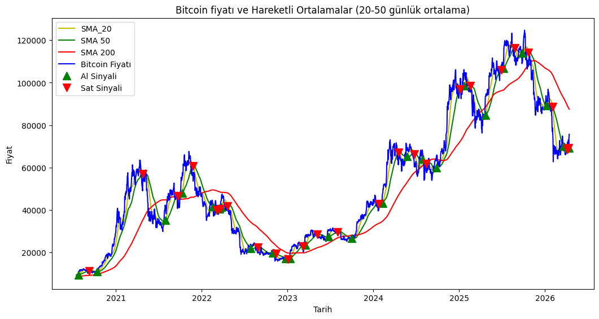
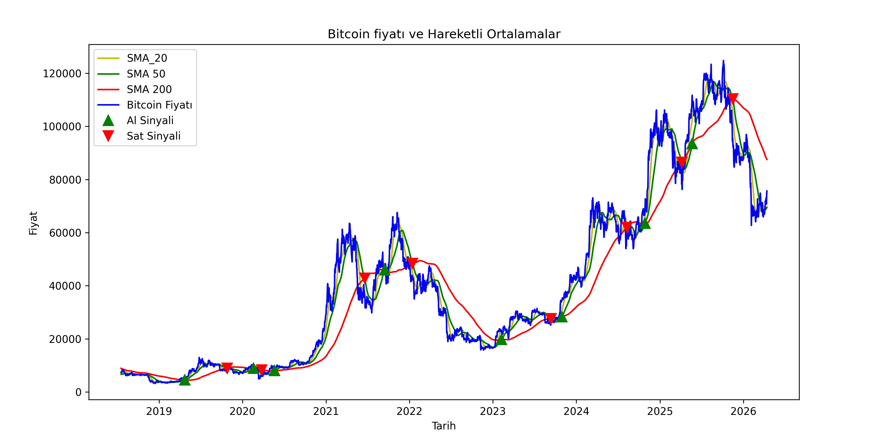

# Kripto Para Analizi

Bu proje, Bitcoin (BTC-USD) için temel zaman serisi analizleri ve görselleştirmeler yapar. Amaç: fiyat verilerini indirip hareketli ortalamalar gibi göstergelerle trendleri ve potansiyel sinyalleri incelemektir.

**Özellikler**
- **Veri Kaynağı:** Yahoo Finance (`yfinance` ile)
- **Göstergeler:** 50 ve 200 günlük Basit Hareketli Ortalama (SMA)
- **Görselleştirme:** Matplotlib ile zaman serisi grafikleri

**Kullanım**
- `main.ipynb` Bitcoin verisini indirir, `SMA_50` ve `SMA_200` hesaplar, grafiği çizer ve `bitcoin_fiyat_ve_hareketli_ortalamalar.png` olarak kaydeder.

**Örnek requirements.txt içeriği**
```
numpy
pandas
matplotlib
yfinance
jupyter
```

**Notlar**
- Yahoo Finance bağlantıları zaman zaman engellenebilir; alternatif veri kaynakları veya önbellek mekanizmaları eklemeyi düşünebilirsiniz.





